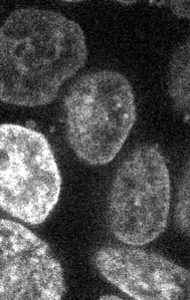
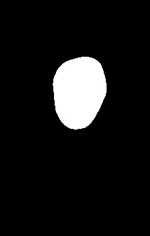

# Allen Cell Image Downloader

This project downloads raw 3D image stacks and segmentation masks from the Allen Cell dataset using Quilt3. The downloaded files are `.ome.tif` Z-stacks: each file contains multiple 2D image slices along the Z axis.

## Setup

Install Python 3.10 or newer, then open PowerShell in this project directory:

```powershell
python -m pip install -r ProofOfConcept/requirements.txt
```

If you use the supplied conda environment, replace `python` with its Python executable.

## Download images

Run the downloader from the project root to download five raw stacks and five segmentation masks for every structure in the dataset:

```powershell
python ProofOfConcept/download_images.py
```

The first run downloads `metadata.csv` into `ProofOfConcept/`. Later runs reuse that local copy. The image files are written to `downloads/`.

For a smaller or targeted download, use optional arguments. This downloads five pairs for TOMM20 and ACTB:

```powershell
python ProofOfConcept/download_images.py --structure TOMM20 ACTB
```

To change the number of pairs or output directory:

```powershell
python ProofOfConcept/download_images.py --num-stacks 2 --output-dir downloads-small
```

The first Quilt3 call may take several minutes because it loads the Allen Cell package manifest. The image files can also be several megabytes each, so allow the download to finish before closing the terminal.

## Create viewable previews

To convert one downloaded Z-stack to a PNG, run:

```powershell
python ProofOfConcept/preview_tiff.py downloads/<file-name>.ome.tif previews/example.png
```

The preview is the middle Z-slice, contrast-normalized for viewing. It is only a 2D representation; the original TIFF remains the complete 3D dataset.

To create two image previews and two corresponding segmentation-mask previews for every structure, run:

```powershell
python ProofOfConcept/visualize_structures.py
```

The script reads `metadata.csv`, selects the first two downloaded pairs for each structure, and saves the middle slices in `visualizations/` as `<structure>_image_1.png`, `<structure>_mask_1.png`, `<structure>_image_2.png`, and `<structure>_mask_2.png`.

Example previews generated from the local downloads:





## Repository contents

- `ProofOfConcept/download_images.py`: downloads raw and segmentation stacks.
- `ProofOfConcept/preview_tiff.py`: converts a representative TIFF slice to PNG.
- `ProofOfConcept/visualize_structures.py`: creates previews for two pairs per structure.
- `previews/`: small example images suitable for viewing on GitHub.
- `visualizations/`: generated previews for all structures.
- `downloads/`: local downloaded data; ignored by Git because the files are large.

.ome.tif